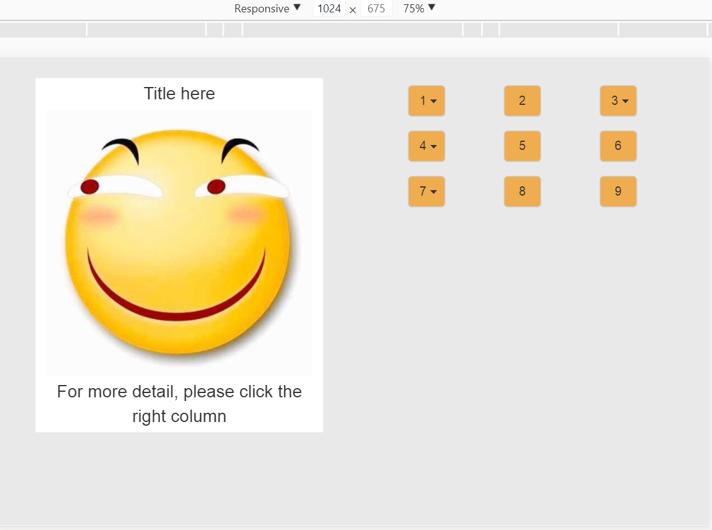
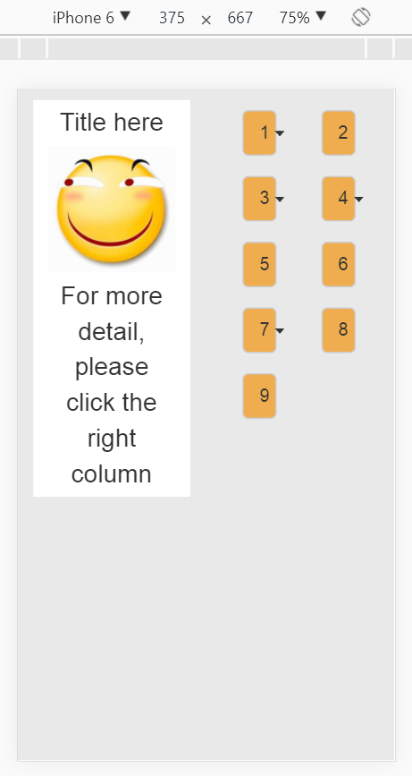
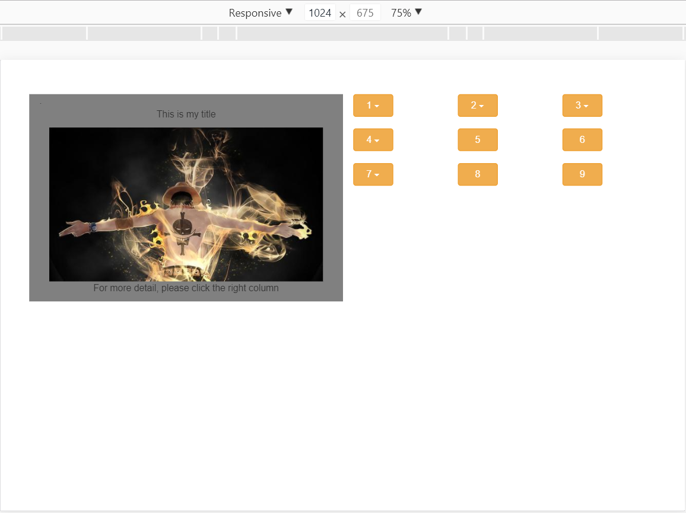
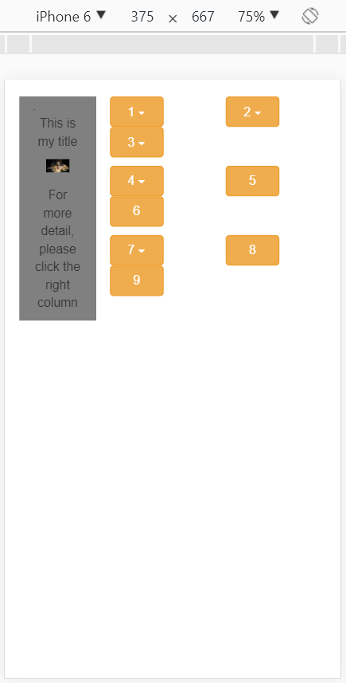
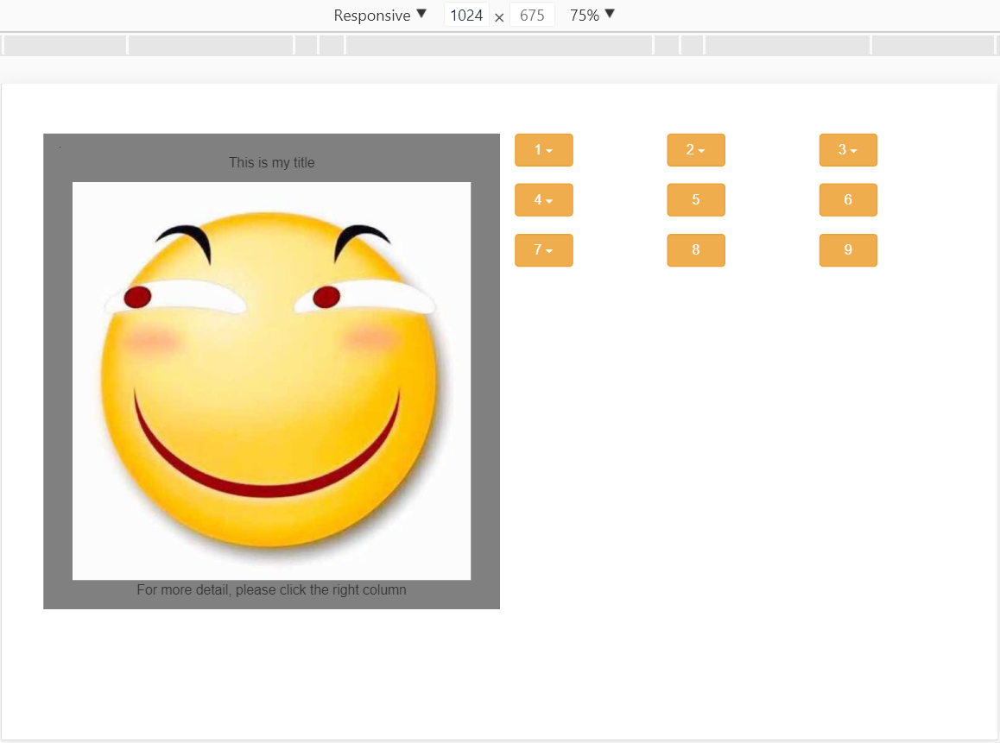
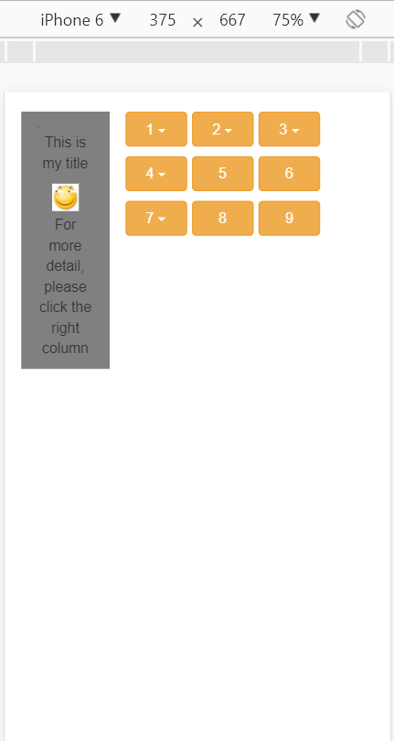

# Feedback of Assignment 1
#### Hua Kang
* 文件命名以php结尾
* button标签中使用50%来定义width并不是一个好的选择。当屏幕较小时，会出现下拉箭头超出按钮范围的情况
* 25px的font-size在小屏幕中略显太大
* 图片加文字可以参考陈总写的范例使用thumbnail缩略图组件
* 在container-fluid下面再加一个class = row的div标签个人感觉没有必要
##### Image
 

#### Huang Xiaohu
* 用CDN的方式引用bootstrap
* 图片可以用缩略图thumbnail组件控制
* 不要将三个按钮放在一个row里面（除非你设置好在所有屏幕大小中都是三个按钮一排），尤其是将三个col-xs-6的按钮放在一个row中在小屏幕会呈现出第一行两个按钮第二行一个按钮的情况
* 代码缩进习惯处理得不好，可以使用sublime HTML Prettify插件进行格式化
* 图片中背景和字的颜色相近，不是好的设计
* github多建立了无用分支，建议用自己命名的分支来管理
##### Image

#### Fang Peng
* 文件名没有后缀且代码文件名最好不要有空格
* push的时候没有将图片一起push上来
* 用CDN的方式引用bootstrap
* 左侧图片区域代码与黄啸虎一模一样且连图片都一样
* 图片与文字可以使用缩略图thumbnail组件
* 按钮的栅栏格式可以设置得更好比如将col-xs-3改为col-xs-4
* 代码缩进习惯处理得不好，可以使用sublime HTML Prettify插件进行格式化
* github多建立了无用分支，建议用自己命名的分支来管理
##### Image

## Conclusion

首先，大家做得不错的地方是都利用到了栅栏格式来调整网页的自适应。但是，貌似大家都没有自己好好利用浏览器来看自己的代码在小屏大屏分别呈现出怎样的画面。导致了小屏很多不合理的设计出现。大家可以多看看陈总的示例，然后调整自己的代码。

P.S.以上是我一家之言，大家可以多多思考，多多交流。（我一个后端怎么就来写前端feedback了呢？）